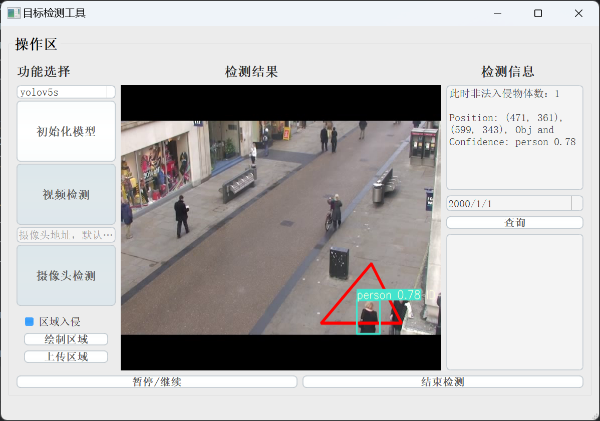

# Intrusion Detection System based on YOLOv5 and DeepSort


**Update 2024.05.03**

---
## Project Introduction
Using PyQt5 to add a visual detection interface for YOLOv5, and implementing simple interface switching and area intrusion detection, as follows:
**Features:**
* UI interface and logical code are separated
* Supports user-selected models
* Outputs detection results and corresponding information
* Supports video, and camera detection
* Supports recording and querying intrusion detection records
* Supports video pause and continue detection
* Supports area intrusion, custom area, and counting.
## Quick Start
**Environment and Related File Configuration:**
 - Set up the environment according to the `requirements`.
 - Install PyQt5 and make sure to install and configure it.
 - Download or train a model and put the `.pt` file into the `weights` folder. You can choose your own weight file, and the program will open the `weights` folder by default.
    -  The YOLOv5 release version used is v5.0:  [Releases · ultralytics/yolov5 (github.com)](https://github.com/ultralytics/yolov5/releases)
 - Need to configure the external tools Qtdesigner and PYUIC in PyCharm.

**How to Use:**

 - Run `detect_logicwd.py` directly to enter the detection interface.
    ```shell script
   python detect_logicwd.py
   ```
## Usage
1. After launching `detect_logicwd.py`, the software interface will be displayed as shown below:

The system interface is divided into the left function selection, the right object detection object information, and the middle detection result screen.
2. First, select an available yolov5 weight file in the **功能选择** section, and then click the **初始化模型** button to load the target detection model. The selection of weight models supports self-trained models, as long as they are placed in the corresponding weights folder and the corresponding comboBox text is added through PyQT.

3. Subsequently, select **视频检测** and perform object detection by uploading local video. Click the **结束检测** button to terminate the current target detection.
   1. Video detection:
   
4. In **视频检测**, you can draw a polygonal area. When an object enters the polygonal area, the category of the object will be detected (the judgment criterion for object entry is the relative position relationship between the center position of the detected box recognized by the target detection and the polygon).
   1. Drawing operation: Check **区域入侵**, click **绘制区域**, click the left mouse button in the **检测结果** area to create the coordinates of the polygon. When the number of created points is greater than or equal to 2, the invasion detection algorithm will automatically start, and only the objects that enter the drawn area will be detected and related detection information will be output, while the objects not outside the area or recognized will not have any output.
      
   2. Upload the json format coordinate file: Prepare the file in advance, the content is organized as follows, (xn, yn) represents the coordinate information of a point of the polygon, and the coordinate system takes the upper left corner area of **检测结果** in the software interface as the origin.
      
      Check **区域入侵**, select the uploaded json file, and the invasion detection algorithm will be enabled.
      
   3. Query the records: You can use the date to query the intrusion records of the day
      
   4. In addition to local videos, real-time video streaming detection is also supported by providing the corresponding video streaming information. Both mouse drawing and uploading area methods are supported for invasion detection, which are not demonstrated due to limitations in computer performance.

## reference
 - Github link1: https://github.com/jaycheney/YOLOv5-Intrusion-Detection-System
 - Github link2: https://github.com/Sharpiless/yolov5-deepsort/

---
If you find this repository useful, please consider giving it a star ⭐️! Thanks!

